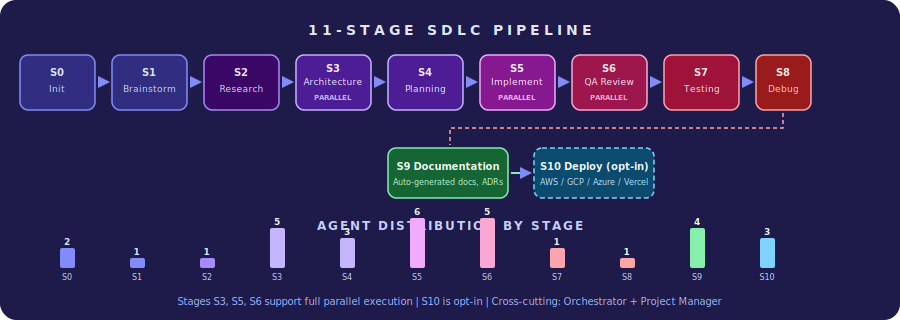
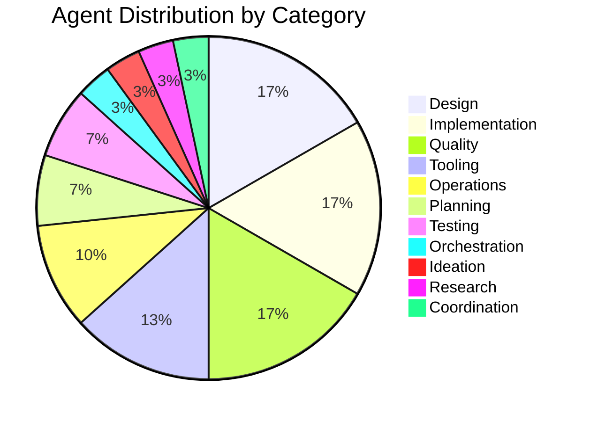
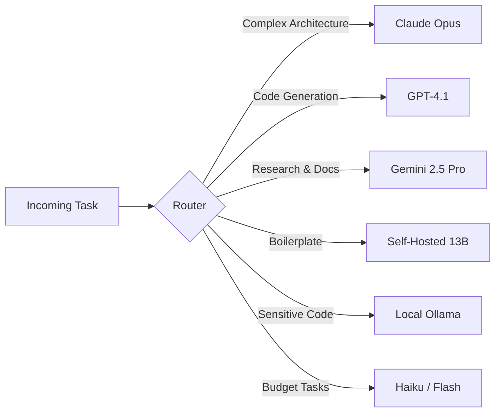
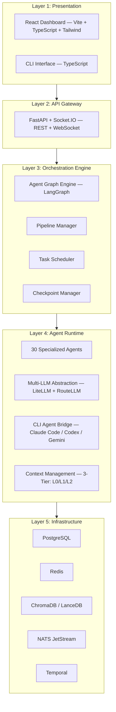

<p align="center">
  <picture>
    <source media="(prefers-color-scheme: dark)" srcset="assets/logo/logo-dark.svg">
    <source media="(prefers-color-scheme: light)" srcset="assets/logo/logo.svg">
    
  </picture>
</p>

<h3 align="center">From Brainstorm to Production — Autonomously</h3>

<p align="center">
  <strong>The open-source, autonomous software development platform powered by 30 specialized AI agents.</strong><br>
  <em>Transform natural language ideas into fully tested, secured, and deployed applications.</em>
</p>

<p align="center">
  <a href="#-quickstart"></a>
  <a href="docs/prd/PRD.md"></a>
  <a href="docs/architecture/ARCHITECTURE.md"></a>
  <a href="docs/design/SYSTEM_DESIGN.md"></a>
</p>

<p align="center">
  
  
  
  
  
  
</p>

---

## What is CodeBot?

CodeBot is an **autonomous, end-to-end software development platform** that transforms a spark of an idea into a fully tested, reviewed, secured, and cloud-deployed application. It orchestrates **30 specialized AI agents** across an **11-stage SDLC pipeline** — covering every phase from brainstorming through production deployment.

Built on the **MASFactory framework** (arXiv:2603.06007), CodeBot models multi-agent workflows as **directed computation graphs** where nodes execute agents and edges encode dependencies and message passing.

<br>

<p align="center">
  
</p>

---

## Key Highlights

<table>
<tr>
<td width="50%">

### 30 Specialized AI Agents
A fleet of purpose-built agents spanning **10 categories** — from brainstorming and architecture to security auditing and deployment. Each agent runs the **Perception-Reasoning-Action (PRA)** cognitive cycle with its own tools, context, and memory.

</td>
<td width="50%">

### Graph-Centric Architecture
Built on **MASFactory** (arXiv:2603.06007). The entire SDLC is a **directed computation graph** with 10 node types (AGENT, SUBGRAPH, LOOP, SWITCH, PARALLEL, MERGE, CHECKPOINT, GATE, TRANSFORM, HUMAN_IN_LOOP) and typed edges for state, message, and control flow.

</td>
</tr>
<tr>
<td width="50%">

### Multi-LLM Intelligence Routing
Not locked to one AI provider. Route tasks to the **best model for the job** — Claude for architecture, GPT for code gen, Gemini for research, self-hosted models for privacy. Supports **6 cloud providers + 7 self-hosted platforms**.

</td>
<td width="50%">

### Agent Isolation via Git Worktrees
Each coding agent works in an **isolated git worktree** — no merge conflicts, no file contention. Agents communicate through the graph engine's typed message passing, never through direct file access.

</td>
</tr>
<tr>
<td width="50%">

### Three Project Modes
**Greenfield** (new from scratch), **Inflight** (join mid-development), and **Brownfield** (modernize legacy) — each with a tailored pipeline configuration and agent workflow.

</td>
<td width="50%">

### Self-Improving Agent Ecosystem
Agents create **skills, hooks, and tools** that other agents consume. The Skill Creator, Hooks Creator, and Tools Creator agents enable the system to grow its own capabilities over time.

</td>
</tr>
</table>

---

## How It Works

```
                    "Build me a SaaS invoicing app with Stripe integration"
                                          |
                                          v
                    +---------------------------------------------+
                    |            S0  PROJECT INITIALIZATION        |
                    |   Detect project type, import codebase,      |
                    |   configure pipeline, set up repositories     |
                    +----------------------+----------------------+
                                           |
                    +----------------------v----------------------+
                    |            S1  BRAINSTORMING                 |
                    |   Explore ideas, define scope, prioritize    |
                    |   features, generate personas, map solutions  |
                    +----------------------+----------------------+
                                           |
                    +----------------------v----------------------+
                    |            S2  RESEARCH                      |
                    |   Evaluate frameworks, discover APIs,        |
                    |   analyze dependencies, security research    |
                    +----------------------+----------------------+
                                           |
                    +----------+-----------+-----------+-----------+
                    |          |           |           |           |
                    v          v           v           v           |
              +---------+ +--------+ +--------+ +---------+      |
              |Architect| |Designer| |Database| |API GW   |      |
              |  Agent  | | Agent  | | Agent  | | Agent   |      |
              +---------+ +--------+ +--------+ +---------+      |
                    |  S3  ARCHITECTURE & DESIGN  (parallel)      |
                    +----------------------+----------------------+
                                           |
                    +----------------------v----------------------+
                    |            S4  PLANNING                      |
                    |   Task decomposition, scheduling, resource   |
                    |   allocation, tech stack confirmation         |
                    +----------------------+----------------------+
                                           |
              +--------+--------+---------+--------+--------+
              |        |        |         |        |        |
              v        v        v         v        v        v
          +------+ +------+ +------+ +------+ +------+ +------+
          |Front | |Back  | |Middle| |Mobile| |Infra | |Integ |
          |End   | |End   | |ware  | |Dev   | |Engr  | |rator |
          +------+ +------+ +------+ +------+ +------+ +------+
                    |  S5  IMPLEMENTATION  (parallel worktrees)   |
                    +----------------------+----------------------+
                                           |
              +---------+---------+--------+---------+--------+
              |         |         |        |         |        |
              v         v         v        v         v        |
          +------+ +--------+ +------+ +------+ +------+     |
          |Code  | |Security| |a11y  | |Perf  | |i18n  |     |
          |Review| |Audit   | |Audit | |Audit | |Audit |     |
          +------+ +--------+ +------+ +------+ +------+     |
                    |  S6  QUALITY ASSURANCE  (parallel)       |
                    +----------------------+----------------------+
                                           |
                    +----------------------v----------------------+
                    |      S7  TESTING  ->  S8  DEBUG & FIX       |
                    |   Unit, Integration, E2E, Visual Regression  |
                    |   Iterative fix loop until all tests pass    |
                    +----------------------+----------------------+
                                           |
                    +----------------------v----------------------+
                    |            S9  DOCUMENTATION                 |
                    |   API docs, README, ADRs, runbooks,          |
                    |   onboarding guides, skill/hook/tool creation |
                    +----------------------+----------------------+
                                           |
                    +----------------------v----------------------+
                    |         S10  DEPLOYMENT  (optional)          |
                    |   AWS / GCP / Azure / Vercel / Railway       |
                    |   CI/CD, monitoring, SSL, DNS, rollback      |
                    +---------------------------------------------+
```

---

## Competitive Landscape

### CodeBot vs. Existing Solutions

<table>
<thead>
<tr>
<th width="180">Capability</th>
<th width="90" align="center">CodeBot</th>
<th width="90" align="center">Cursor</th>
<th width="90" align="center">GitHub Copilot</th>
<th width="90" align="center">Devin</th>
<th width="90" align="center">GPT Engineer</th>
<th width="90" align="center">Bolt.new</th>
</tr>
</thead>
<tbody>
<tr>
<td><strong>Full SDLC Pipeline</strong></td>
<td align="center">11 stages</td>
<td align="center">-</td>
<td align="center">-</td>
<td align="center">Partial</td>
<td align="center">Partial</td>
<td align="center">-</td>
</tr>
<tr>
<td><strong>Specialized Agents</strong></td>
<td align="center">30</td>
<td align="center">1</td>
<td align="center">1</td>
<td align="center">1</td>
<td align="center">1</td>
<td align="center">1</td>
</tr>
<tr>
<td><strong>Multi-LLM Routing</strong></td>
<td align="center">13+ models</td>
<td align="center">3-4</td>
<td align="center">GPT only</td>
<td align="center">1</td>
<td align="center">2-3</td>
<td align="center">1</td>
</tr>
<tr>
<td><strong>Self-Hosted LLM</strong></td>
<td align="center">7 platforms</td>
<td align="center">-</td>
<td align="center">-</td>
<td align="center">-</td>
<td align="center">-</td>
<td align="center">-</td>
</tr>
<tr>
<td><strong>Brainstorming Phase</strong></td>
<td align="center">Yes</td>
<td align="center">-</td>
<td align="center">-</td>
<td align="center">-</td>
<td align="center">-</td>
<td align="center">-</td>
</tr>
<tr>
<td><strong>Architecture Design</strong></td>
<td align="center">C4 Model</td>
<td align="center">-</td>
<td align="center">-</td>
<td align="center">Ad hoc</td>
<td align="center">-</td>
<td align="center">-</td>
</tr>
<tr>
<td><strong>Security Pipeline</strong></td>
<td align="center">6 tools</td>
<td align="center">-</td>
<td align="center">Partial</td>
<td align="center">-</td>
<td align="center">-</td>
<td align="center">-</td>
</tr>
<tr>
<td><strong>Agent Isolation</strong></td>
<td align="center">Git worktrees</td>
<td align="center">-</td>
<td align="center">-</td>
<td align="center">Container</td>
<td align="center">-</td>
<td align="center">WebContainer</td>
</tr>
<tr>
<td><strong>Mobile Development</strong></td>
<td align="center">Native + Cross</td>
<td align="center">-</td>
<td align="center">-</td>
<td align="center">-</td>
<td align="center">-</td>
<td align="center">-</td>
</tr>
<tr>
<td><strong>Brownfield / Legacy</strong></td>
<td align="center">Full support</td>
<td align="center">Edit only</td>
<td align="center">Suggest</td>
<td align="center">Partial</td>
<td align="center">-</td>
<td align="center">-</td>
</tr>
<tr>
<td><strong>Multi-Repo</strong></td>
<td align="center">Yes</td>
<td align="center">-</td>
<td align="center">-</td>
<td align="center">-</td>
<td align="center">-</td>
<td align="center">-</td>
</tr>
<tr>
<td><strong>Real-time Collab</strong></td>
<td align="center">CRDT-based</td>
<td align="center">-</td>
<td align="center">-</td>
<td align="center">View only</td>
<td align="center">-</td>
<td align="center">-</td>
</tr>
<tr>
<td><strong>Auto-Deployment</strong></td>
<td align="center">10+ targets</td>
<td align="center">-</td>
<td align="center">-</td>
<td align="center">Limited</td>
<td align="center">Limited</td>
<td align="center">Netlify</td>
</tr>
<tr>
<td><strong>Open Source</strong></td>
<td align="center">Apache 2.0</td>
<td align="center">Proprietary</td>
<td align="center">Proprietary</td>
<td align="center">Proprietary</td>
<td align="center">MIT</td>
<td align="center">Proprietary</td>
</tr>
<tr>
<td><strong>Offline Mode</strong></td>
<td align="center">Full pipeline</td>
<td align="center">-</td>
<td align="center">-</td>
<td align="center">-</td>
<td align="center">-</td>
<td align="center">-</td>
</tr>
</tbody>
</table>

### What Makes CodeBot Different

<table>
<tr>
<td align="center" width="20%">

**Autonomous Pipeline**

11 SDLC Stages
Brainstorm to Deploy
Zero Manual Coding
3 Project Modes

</td>
<td align="center" width="20%">

**30 AI Agents**

Parallel Execution
PRA Cognitive Cycle
Self-Improving Skills
Git Worktree Isolation

</td>
<td align="center" width="20%">

**Multi-LLM Intelligence**

6 Cloud Providers
7 Self-Hosted Platforms
Task & Privacy Routing
Offline-First Support

</td>
<td align="center" width="20%">

**Enterprise Ready**

Security Pipeline
CRDT Collaboration
Multi-Repo Support
Compliance Scanning

</td>
<td align="center" width="20%">

**Platform Agnostic**

Web + Mobile + Backend
Native iOS & Android
10+ Deploy Targets
Multi-Cloud Support

</td>
</tr>
</table>

---

## Agent Catalog

CodeBot's 30 agents are organized into **10 functional categories**:



<table>
<thead>
<tr>
<th>Category</th>
<th>Agents</th>
<th>Pipeline Stage</th>
<th>Description</th>
</tr>
</thead>
<tbody>
<tr>
<td><strong>Orchestration</strong></td>
<td>Orchestrator</td>
<td>All</td>
<td>Master coordinator — monitors all agents, manages pipeline flow, handles escalations</td>
</tr>
<tr>
<td><strong>Ideation</strong></td>
<td>Brainstorming Agent</td>
<td>S1</td>
<td>Interactive idea exploration, problem-solution mapping, feature prioritization</td>
</tr>
<tr>
<td><strong>Planning</strong></td>
<td>Planner, TechStack Builder</td>
<td>S4</td>
<td>Task decomposition, dependency graphs, technology selection and confirmation</td>
</tr>
<tr>
<td><strong>Research</strong></td>
<td>Researcher</td>
<td>S2</td>
<td>Framework evaluation, API discovery, dependency analysis, security research</td>
</tr>
<tr>
<td><strong>Design</strong></td>
<td>Architect, Designer, Template, Database, API Gateway</td>
<td>S3-S4</td>
<td>System architecture (C4), UI/UX design, schema design, API specifications</td>
</tr>
<tr>
<td><strong>Implementation</strong></td>
<td>Frontend Dev, Backend Dev, Middleware Dev, Mobile Dev, Infra Engineer</td>
<td>S5</td>
<td>Parallel code generation across all layers in isolated git worktrees</td>
</tr>
<tr>
<td><strong>Quality</strong></td>
<td>Security Auditor, Code Reviewer, Accessibility, Performance, i18n/L10n</td>
<td>S6</td>
<td>Comprehensive quality gates — security, accessibility, performance, internationalization</td>
</tr>
<tr>
<td><strong>Testing</strong></td>
<td>Tester, Debugger</td>
<td>S7-S8</td>
<td>Test generation and execution, automated debugging with iterative fix loops</td>
</tr>
<tr>
<td><strong>Operations</strong></td>
<td>DevOps, GitHub Agent, Documentation Writer</td>
<td>S9-S10</td>
<td>CI/CD generation, deployment automation, documentation generation</td>
</tr>
<tr>
<td><strong>Tooling</strong></td>
<td>Skill Creator, Hooks Creator, Tools Creator, Integrations</td>
<td>Cross-cutting</td>
<td>Self-improving ecosystem — agents create skills, hooks, and tools for other agents</td>
</tr>
<tr>
<td><strong>Coordination</strong></td>
<td>Project Manager</td>
<td>Cross-cutting</td>
<td>Progress tracking, status reports, blocker identification, stakeholder updates</td>
</tr>
</tbody>
</table>

---

## Multi-LLM Support

CodeBot is **provider-agnostic** — use the best model for each task, or run entirely self-hosted.

### Cloud Providers

| Provider | Models | Best For |
|----------|--------|----------|
| **Anthropic** | Claude Opus 4.6, Sonnet 4, Haiku 3.5 | Architecture, complex reasoning, code review |
| **OpenAI** | GPT-4.1, o3, o4-mini | Code generation, API design, testing |
| **Google** | Gemini 2.5 Pro, 2.5 Flash | Research, documentation, multi-modal input |
| **Mistral** | Large, Codestral | European compliance, fast inference |
| **Cohere** | Command R+ | Enterprise search, RAG, document analysis |
| **DeepSeek** | V3, DeepSeek-Coder | Cost-effective code generation |

### Self-Hosted Platforms

| Platform | Use Case |
|----------|----------|
| **Ollama** | Local development, privacy-sensitive projects |
| **vLLM** | Production self-hosted, batch processing |
| **LocalAI** | Air-gapped environments (OpenAI-compatible) |
| **LM Studio** | Desktop experimentation |
| **llama.cpp** | Lightweight local/edge inference |
| **TGI** | HuggingFace model serving |
| **Text Gen WebUI** | Advanced local model configuration |

### Intelligent Routing



Routing decisions are based on **task type**, **complexity**, **privacy requirements**, **cost**, and **latency**. Fallback chains ensure zero downtime if a provider is unavailable.

---

## Security Pipeline

Every line of generated code passes through a **6-tool security gauntlet** before advancing in the pipeline:

| Tool | Purpose | Detects |
|------|---------|---------|
| **Semgrep** | Static analysis (SAST) | OWASP Top 10, injection flaws, XSS, insecure patterns |
| **SonarQube** | Code quality + security | Code smells, bugs, vulnerabilities, coverage gaps |
| **Trivy** | Container & dependency scanning | CVEs, misconfigurations, license violations |
| **Gitleaks** | Secret detection | API keys, tokens, passwords, certificates in code |
| **ScanCode/ORT** | License compliance | GPL contamination, license incompatibilities |
| **Shannon Pro** | DAST + advanced scanning | Runtime vulnerabilities, API security issues |

```
Code Generated ──> Semgrep ──> SonarQube ──> Trivy ──> Gitleaks ──> ScanCode ──> Shannon
     |                                                                              |
     |                          QUALITY GATE                                        |
     |            (must pass all scans to proceed)                                  |
     +──────────────────── FAIL: return to S8 Debug ────────────────────────────────+
```

---

## Architecture Overview

<p align="center">
  
</p>

### 5-Layer Architecture



---

## Tech Stack

<table>
<thead>
<tr>
<th width="140">Domain</th>
<th>Technologies</th>
</tr>
</thead>
<tbody>
<tr>
<td><strong>Backend</strong></td>
<td>Python 3.12+, FastAPI, SQLAlchemy 2.0, Pydantic v2, asyncio TaskGroup</td>
</tr>
<tr>
<td><strong>Orchestration</strong></td>
<td>LangGraph (graph engine), Temporal (durable workflows), NATS JetStream (event bus)</td>
</tr>
<tr>
<td><strong>Dashboard</strong></td>
<td>React 19, Vite, TypeScript 5.5+, Tailwind CSS 4, Zustand 5, TanStack Query, React Flow</td>
</tr>
<tr>
<td><strong>CLI</strong></td>
<td>TypeScript (Node.js 22 LTS)</td>
</tr>
<tr>
<td><strong>LLM Layer</strong></td>
<td>LiteLLM (proxy), RouteLLM (cost-quality routing), Langfuse (observability)</td>
</tr>
<tr>
<td><strong>Storage</strong></td>
<td>PostgreSQL (state), Redis (cache/pubsub), ChromaDB/LanceDB (vector), DuckDB (analytics)</td>
</tr>
<tr>
<td><strong>Security</strong></td>
<td>Semgrep, SonarQube, Trivy, Gitleaks, ScanCode/ORT, Shannon Pro</td>
</tr>
<tr>
<td><strong>Collaboration</strong></td>
<td>Yjs (CRDT), Socket.IO (real-time), Monaco Editor, xterm.js</td>
</tr>
<tr>
<td><strong>Infrastructure</strong></td>
<td>Docker, Kubernetes, Terraform, Helm</td>
</tr>
<tr>
<td><strong>Package Managers</strong></td>
<td>uv (Python), pnpm (Node.js), Turborepo (monorepo)</td>
</tr>
</tbody>
</table>

---

## Deployment Targets

CodeBot can deploy your generated application to **10+ platforms**:

<table>
<thead>
<tr>
<th width="160">Platform</th>
<th>Services</th>
<th width="100" align="center">Type</th>
</tr>
</thead>
<tbody>
<tr><td><strong>AWS</strong></td><td>ECS, EKS, Lambda, S3+CloudFront, Amplify, App Runner</td><td align="center">Cloud</td></tr>
<tr><td><strong>Google Cloud</strong></td><td>Cloud Run, GKE, Cloud Functions, Firebase, App Engine</td><td align="center">Cloud</td></tr>
<tr><td><strong>Azure</strong></td><td>AKS, Azure Functions, App Service, Static Web Apps</td><td align="center">Cloud</td></tr>
<tr><td><strong>Vercel</strong></td><td>Edge functions, ISR, preview deployments</td><td align="center">PaaS</td></tr>
<tr><td><strong>Railway</strong></td><td>Database provisioning, environment management</td><td align="center">PaaS</td></tr>
<tr><td><strong>Netlify</strong></td><td>Serverless functions, form handling</td><td align="center">PaaS</td></tr>
<tr><td><strong>Fly.io</strong></td><td>Global edge deployment, Machines API</td><td align="center">PaaS</td></tr>
<tr><td><strong>DigitalOcean</strong></td><td>App Platform, Droplets, Kubernetes</td><td align="center">Cloud</td></tr>
<tr><td><strong>Apple App Store</strong></td><td>Build, signing, TestFlight, submission</td><td align="center">Mobile</td></tr>
<tr><td><strong>Google Play</strong></td><td>Build, signing, internal testing, submission</td><td align="center">Mobile</td></tr>
</tbody>
</table>

---

## Project Structure

```
codebot/
|
+-- apps/
|   +-- server/              # FastAPI backend (Python)
|   +-- dashboard/           # React dashboard (Vite + TypeScript)
|   +-- cli/                 # CLI application (TypeScript)
|
+-- libs/
|   +-- agent-sdk/           # Agent base classes and tools
|   +-- graph-engine/        # Graph execution engine
|   +-- shared-types/        # Shared TypeScript types
|
+-- sdks/
|   +-- python/              # Python client SDK
|   +-- typescript/          # TypeScript client SDK
|
+-- configs/                 # YAML pipeline & agent configs
+-- docker-compose.yml       # Local dev stack (PG, Redis, NATS)
+-- pyproject.toml           # Python workspace root
+-- package.json             # Node.js workspace root
+-- turbo.json               # Turborepo config
```

---

## Quickstart

### Prerequisites

- Python 3.12+
- Node.js 22 LTS
- Docker & Docker Compose
- At least one LLM API key (or Ollama for self-hosted)

### Installation

```bash
# Clone the repository
git clone https://github.com/veerababumanyam/CodeBot.git
cd codebot

# Start infrastructure (PostgreSQL, Redis, NATS)
docker-compose up -d

# Install Python dependencies
uv sync

# Install Node dependencies
pnpm install

# Apply database migrations
uv run alembic upgrade head

# Start the server
uv run uvicorn apps.server.src.codebot.main:app --reload

# Start the dashboard (separate terminal)
pnpm -F dashboard dev
```

### Your First Project

```bash
# Via CLI
codebot init --name "my-saas-app" --type greenfield

# Or describe your idea in natural language
codebot start "Build a project management tool with kanban boards,
               team collaboration, and Stripe billing"
```

---

## Target Users

| Persona | Use Case | Key Benefit |
|---------|----------|-------------|
| **Solo Developer** | Build MVPs and side projects | End-to-end automation from idea to deployed app |
| **Tech Lead** | Manage parallel feature development | Autonomous agent teams with pipeline visibility |
| **Startup CTO** | Rapid prototyping with limited resources | Production-grade code without a large team |
| **Enterprise Architect** | Enforce standards at scale | Customizable pipelines with governance gates |
| **QA Engineer** | Automated quality assurance | Full test generation, execution, and regression detection |
| **Product Manager** | Non-technical product development | Brainstorm-to-product pipeline, zero coding required |
| **Mobile Developer** | Cross-platform and native apps | iOS + Android generation from single requirements |
| **DevOps Engineer** | Infrastructure automation | Auto-generated CI/CD, IaC, and monitoring setup |
| **Open Source Maintainer** | Project maintenance at scale | Automated PR review, issue triage, contribution management |

---

## Guiding Principles

1. **Everything is in scope.** If it is part of software development, CodeBot handles it.
2. **Human-in-the-loop, not human-in-the-way.** Collaborate in real-time, approve at gates, override when needed.
3. **Best model for the job.** Cloud, self-hosted, or local — whatever is optimal for each task.
4. **Platform agnostic.** Web, iOS, Android, backend, infrastructure — one pipeline to rule them all.
5. **Extensible by design.** Agents create skills, hooks, and tools that other agents consume.
6. **Open source forever.** Community-driven, transparent, zero vendor lock-in.

---

## Documentation

| Document | Description |
|----------|-------------|
| [Product Requirements](docs/prd/PRD.md) | Full PRD v2.5 — capabilities, personas, pipeline stages |
| [Architecture](docs/architecture/ARCHITECTURE.md) | C4 diagrams, 5-layer architecture, subsystem designs |
| [System Design](docs/design/SYSTEM_DESIGN.md) | Graph engine, agent specs, pipeline orchestration |
| [Agent Catalog](docs/design/AGENT_CATALOG.md) | All 30 agents with specs, tools, and collaboration matrix |
| [Agent Workflows](docs/workflows/AGENT_WORKFLOWS.md) | Workflow orchestration, sequence diagrams, error handling |
| [API Specification](docs/api/API_SPECIFICATION.md) | REST API endpoint definitions |
| [Data Models](docs/design/DATA_MODELS.md) | Pydantic/SQLAlchemy schema definitions |
| [Technical Requirements](docs/technical/TECHNICAL_REQUIREMENTS.md) | Runtime versions, dependencies, infrastructure |

---

## Contributing

We welcome contributions! CodeBot is in active development — check the issues for areas where you can help.

```bash
# Run tests
uv run pytest

# Lint and format
uv run ruff check .
uv run ruff format .

# Type checking
uv run mypy --strict apps/server/
```

---

## License

CodeBot is open source under the **Apache License 2.0**. See [LICENSE](LICENSE) for details.

---

<p align="center">
  <sub>Built with purpose by the CodeBot community.</sub><br>
  <sub>Inspired by <a href="https://arxiv.org/abs/2603.06007">MASFactory</a> (arXiv:2603.06007)</sub>
</p>
